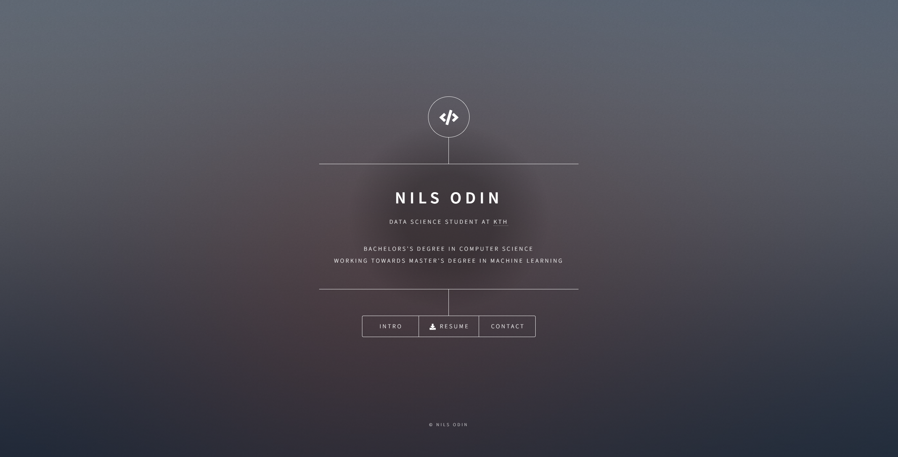

# nilsodin.se

This is the source code for my personal webpage, which can be found [here](www.nilsodin.se) 👈

The webpage is based on the *Dimension* template available from [html5up.net](https://html5up.net/).

